# 🩺 OpenDeepWiki: Your AI-Powered Code Documentation Assistant

Welcome to **opendeepwiki**! Interact with your codebase like never before. opendeepwiki automatically generates comprehensive documentation and detailed examples, tailored to your code, accessible via an interactive web UI.

It makes you an expert of any codebase, any repo.

## ✨ Key Features

-   **Intelligent Documentation:** Generate documentation automatically based on your code's structure, docstrings, and comments.
-   **Interactive Chat:** Ask specific questions about your codebase and get focused answers from an AI trained on *your* repository.
  - Review code to see downstream impact etc...
-   **Conversation History:** Save and manage multiple conversations for each repository, with the ability to switch between them.
-   **Modern UI:** Clean, responsive interface inspired by opendeepwiki with markdown rendering and code syntax highlighting.
-   **Remote & Local Repos:** Analyze public GitHub repositories or upload your local projects directly.
-   **Multiple LLM Options:** Choose from various Gemini and Claude models.
-   **Extensible:** Built with Docker and modern Python tooling.

## 🚀 Getting Started


Follow these steps to get opendeepwiki up and running:

1.  **Clone the Repository:**
    ```bash
    git clone https://github.com/Flopsky/opendeepwiki.git
    cd opendeepwiki
    ```

2.  **Configure API Keys:**
    -   Fill in your API keys in the `.env` for the desired language models (Gemini required, Anthropic optional). See [Configuration](#configuration) for details.
    -   Langfuse setup is optional for tracing.

3.  **Build and Run with Docker:**
    ```bash
    docker compose up --build -d
    ```

4.  **Access the Web UI:** Open your browser and navigate to `http://localhost:7860`.

## 💬 Chat With Your Code!

Once opendeepwiki is running, you can interact with the "Custom Documentalist" – a specialized AI assistant trained on your specific repository:

1.  **Open Web UI:** Go to `http://localhost:7860`.
2.  **Load Your Repository:**
    *   **GitHub Repo:** Paste the URL into the "Repository URL" field in the sidebar and click "Initialize".
    *   **Local Repo:** Create a `.zip` archive of your local repository folder. Use the "Upload Repository (.zip)" button in the sidebar to upload it.
3.  **Wait for Processing:** opendeepwiki will clone/extract your code and analyze it (docstrings, documentation files, configs), storing the processed data in shared Docker volumes. Status messages will appear in the sidebar.
4.  **Select the Expert:** Choose "Custom Documentalist" from the "Select Model" dropdown.
5.  **Ensure API Keys:** Double-check that your necessary API keys are set in the `.env` file.
6.  **Start Asking:** Use the chat interface to ask questions about your repository. Get insights and explanations directly from the AI that understands your code!
7.  **Manage Conversations:**
    *   **New Chat:** Click the "New Chat" button in the sidebar to start a fresh conversation while preserving your previous ones.
    *   **Switch Conversations:** Click on any saved conversation in the sidebar to continue where you left off.
    *   **Delete Conversations:** Remove unwanted conversations by clicking the trash icon next to them in the sidebar.
    *   **Persistent History:** Your conversation history is automatically saved and will be available even if you close and reopen the application.

## 🏗️ How It Works

opendeepwiki uses a microservice architecture orchestrated by Docker Compose:

```mermaid
%% Mermaid Diagram - Application Architecture (Darker Grayscale)
graph TD
    %%------------------------------------%%
    %%---   Darker Grayscale Definitions ---%%
    %%------------------------------------%%
    %% Darker background for subgraphs, light text
    classDef subgraphStyle fill:#616161,stroke:#424242,stroke-width:1px,color:#eeeeee;
    %% Mid-gray background for standard nodes, dark text
    classDef nodeStyle fill:#bdbdbd,stroke:#424242,stroke-width:1px,color:#212121;
    %% Darker gray for important nodes, light text
    classDef importantNodeStyle fill:#757575,stroke:#424242,stroke-width:1.5px,color:#eeeeee;
    %% User node matches standard nodes, but with thicker black border
    classDef userStyle fill:#bdbdbd,stroke:#000000,stroke-width:2px,color:#212121;

    %%--------------------------------%%
    %%---      User Definition     ---%%
    %%--------------------------------%%
    A[🧑‍💻 User]:::userStyle

    %%--------------------------------%%
    %%---      Frontend Service    ---%%
    %%--------------------------------%%
    subgraph Srv_Frontend ["🖥️ Frontend Service (React UI)"]
        direction TB
        B("Modern Web UI"):::nodeStyle
        B1{"<br/>📜 History Mgmt"}:::nodeStyle
        B2{"<br/>📄 Markdown Render"}:::nodeStyle
        B3{"<br/>💻 Code Highlight"}:::nodeStyle
        B -- "Sends Requests" --> B1
        B -- "Displays Content" --> B2 & B3
    end
    class Srv_Frontend subgraphStyle;

    %%--------------------------------%%
    %%--- Simple Adapter Service   ---%%
    %%--------------------------------%%
    subgraph Srv_SimpleAdapter ["🔌 Simple Adapter Service"]
        direction TB
        C("API Gateway"):::nodeStyle
        C1{"<br/>🚀 Repo Init Trigger"}:::nodeStyle
        C -- "Handles UI Requests" --> C1
    end
    class Srv_SimpleAdapter subgraphStyle;

    %%--------------------------------%%
    %%---  Initialization Logic    ---%%
    %%--------------------------------%%
    subgraph Srv_Init ["✨ Initialization Logic"]
         direction LR
         %% Optional: Slightly different shade for this specific subgraph if needed
         %% style Srv_Init fill:#6a6a6a,stroke:#4f4f4f;
         C1 -- "GitHub URL?" --> C_URL{"<br/>🔗 Init via URL"}:::nodeStyle
         C1 -- "ZIP Upload?" --> C_ZIP{"<br/>📦 Init via Upload"}:::nodeStyle
         C_URL -- "Clones Repo" --> D["Git Clone"]:::nodeStyle
         C_ZIP -- "Extracts Archive" --> G["Extract Zip"]:::nodeStyle
         D --> E["💾 Volume:<br/>repository_data"]:::importantNodeStyle
         G --> E
    end
    class Srv_Init subgraphStyle;


    %%--------------------------------%%
    %%---   Classifier Service     ---%%
    %%--------------------------------%%
    subgraph Srv_Classifier ["🏷️ Classifier Service"]
        direction TB
        H("Classifier Endpoint"):::nodeStyle
        I{"<br/>🔬 File Classification &<br/>Data Extraction"}:::nodeStyle
        H --> I
    end
    class Srv_Classifier subgraphStyle;

    %%--------------------------------%%
    %%---   Model Server Service   ---%%
    %%--------------------------------%%
    subgraph Srv_ModelServer ["🧠 Model Server Service"]
        direction TB
        M("Model Server Endpoint"):::nodeStyle
        N{"<br/>🧭 Select Model Logic"}:::nodeStyle
        M --> N
    end
    class Srv_ModelServer subgraphStyle;

    %%--------------------------------%%
    %%---   Libraire Service       ---%%
    %%--------------------------------%%
    subgraph Srv_Libraire ["📚 Libraire Service (Custom Documentalist)"]
         direction TB
         Q("Libraire Endpoint"):::nodeStyle
         R{"<br/>💡 Retrieve Data &<br/>Augment Query"}:::nodeStyle
         Q --> R
    end
    class Srv_Libraire subgraphStyle;

    %%--------------------------------%%
    %%--- Docker & Browser Data  ---%%
    %%--------------------------------%%
    subgraph DataStorage ["💾 Data Storage"]
        direction TB

        subgraph DockerVolumes ["🐳 Shared Docker Volumes"]
            direction TB
            %% Optional: Slightly different shade for this specific subgraph group if needed
            %% style DockerVolumes fill:#5a5a5a,stroke:#333333;
            E -- "Provides Repo Path" --> H
            I -- "Saves Classified Data" --> J["<br/>📄 Volume:<br/>docstrings.json"]:::importantNodeStyle
            I -- "Saves Classified Data" --> K["<br/>📄 Volume:<br/>docs.json"]:::importantNodeStyle
            I -- "Saves Classified Data" --> L["<br/>⚙️ Volume:<br/>configs.json"]:::importantNodeStyle
            R -- "Reads Context" ---> J & K & L
        end
        class DockerVolumes subgraphStyle;

        subgraph BrowserStorage ["🌐 Browser Local Storage"]
            direction TB
            %% Optional: Slightly different shade for this specific subgraph group if needed
            %% style BrowserStorage fill:#5a5a5a,stroke:#333333;
            S["<br/>💬 History"]:::importantNodeStyle
            T["<br/>⚙️ Prefs"]:::importantNodeStyle
        end
        class BrowserStorage subgraphStyle;
    end
    class DataStorage subgraphStyle;


    %%--------------------------------%%
    %%---   External LLM APIs      ---%%
    %%--------------------------------%%
    subgraph ExternalAPIs ["☁️ External LLM APIs"]
        direction TB
        O("🤖 Gemini API"):::nodeStyle
        P("🤖 Anthropic API"):::nodeStyle
    end
    class ExternalAPIs subgraphStyle;


    %%--------------------------------%%
    %%--- Overall System Flow      ---%%
    %%--------------------------------%%
    A -- "Interacts" --> B

    %% Frontend <-> Browser Storage
    B -- "Manages State" --> BrowserStorage

    %% Frontend -> Adapter
    B -- "Sends API Request" --> C

    %% Adapter -> Init Logic (Triggered)
    %% Implicit connection via C1

    %% Adapter -> Model Server (Main Path)
    C -- "Forwards Request" --> M

    %% Init Logic -> Classifier (via Volume E)
    %% Implicit connection E --> H shown in DataStorage

    %% Classifier -> Volumes
    %% Implicit connection I --> J, K, L shown in DataStorage

    %% Model Server -> LLMs / Libraire
    M -- "Routes Request" --> N
    N -- "Direct LLM Query" --> O & P
    N -- "Custom Query (Needs Context)" --> Q

    %% Libraire -> Volumes -> LLMs
    %% Implicit connection R --> J, K, L shown in DataStorage
    R -- "Augmented LLM Query" --> O & P

    %% LLM -> Model Server / Libraire (Response)
    O & P -- "LLM Response" --> N
    O & P -- "LLM Response" --> R

    %% Libraire -> Model Server (Response)
    R -- "Contextualized Response" --> Q
    Q -- "Processed Response" --> N

    %% Model Server -> Adapter -> Frontend (Response)
    N -- "Aggregated Response" --> M
    M -- "Final Response" --> C
    C -- "Sends Data to UI" --> B

    %% Frontend -> User (Display)
    B -- "Displays Result" --> A

```



-   **Frontend Service (React):** Provides a modern web UI with conversation history management, markdown rendering, and code syntax highlighting. Uses browser localStorage to persist conversations and user preferences.
-   **Simple Adapter Service:** Acts as a bridge between the frontend and backend services, handling API requests and repository initialization.
-   **Classifier Service:** Receives the path to the repository code, classifies files (code, docs, config), extracts relevant data (like docstrings), and saves structured JSON to shared volumes.
-   **Model Server Service:** Routes user queries based on the selected model. For standard models, it calls the respective external APIs. For "Custom Documentalist", it forwards the query to the Libraire service.
-   **Libraire Service:** Handles queries for the "Custom Documentalist". It retrieves the processed data (JSON files) from the shared volumes, potentially augments the user query with this context, interacts with external LLMs (Gemini/Claude) for generation, and returns the final response.
-   **Shared Volumes:** Docker volumes used to share repository code and processed JSON data between services.
-   **Browser Local Storage:** Used by the frontend to persist conversation history and user preferences across sessions.

## ⚙️ Configuration

opendeepwiki uses environment variables for configuration. Create a `.env` file in the project root (you can copy `.env.example`).

**Required:**

-   `GEMINI_API_KEY`: Your Google Gemini API key (used by Classifier and potentially other models).

**Optional (for Langfuse tracing):**

-   `LANGFUSE_PUBLIC_KEY`: Your Langfuse public key.
-   `LANGFUSE_SECRET_KEY`: Your Langfuse secret key.
-   `LANGFUSE_HOST`: Your Langfuse host URL (e.g., `https://cloud.langfuse.com`).

## ✅ TODO / Roadmap

-   [x] Index coding files (docstrings) for context.
-   [x] Add local repository upload via zip file.
-   [x] Index documentation files (`.md`) for context.
-   [x] Index configuration files (`.yaml`) for context.
-   [x] Improve file classification accuracy and robustness.
-   [x] Modernize UI with opendeepwiki-like interface.
-   [x] Add conversation history management.
-   [x] Implement markdown rendering and code syntax highlighting.
-   [ ] Add more sophisticated RAG techniques in Libraire.
-   [ ] Add file browser for repository exploration.

## 🤔 Why opendeepwiki?

1.  **Deeper Understanding:** Quickly grasp complex codebases through AI-generated explanations and targeted answers.
2.  **Time Savings:** Automate documentation generation and searching, freeing up developer time.
3.  **Faster Onboarding:** Help new team members get up to speed quickly with relevant, context-aware documentation.
4.  **Improved Collaboration:** Ensure consistent understanding across the team with accessible, accurate information.
5.  **Code Quality:** Encourage better documentation habits and understanding of best practices.

## 🤝 Contributing

Contributions are welcome! Feel free to open an issue or submit a pull request for bug fixes, features, or improvements.

---

Happy Documenting! If you have questions or feedback, please reach out.
